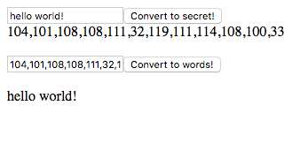

# Code Maker and Breaker
A soul-crushing quiz in which we were tested on our ability to create and manage a repo on Github for a simple app that encodes words into UTF-16, and vice versa.

## Screenshot


## How to run this project
* Use npm to install http-server in your terminal:
```sh
npm install -g http-server
```
* Run the server in your terminal
```sh
hs -p 9999
```
* Open chrome and navigate to:
```
localhost: 9999
```
* Type some words into the first empty field.
* Click the 'Convert to secret!' button.
* Observe the result.
* Copy the result, and paste it into the second empty field.
* Click the 'Convert to words!' button.
* Open refrigerator.
* Grab beer.
* Open beer.
* Take a shower.
* Drink beer in the shower.
* Cry in the shower.
